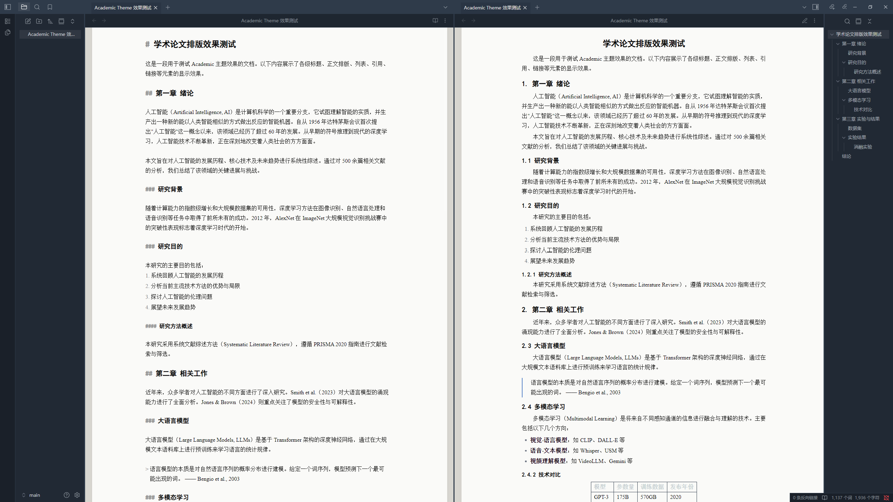

# Academic Theme for Obsidian

一款学术论文风格的 Obsidian 主题，模拟 LaTeX 排版的阅读体验。

## 特性

- **分区配色** — 暗色侧边栏（墨蓝色）+ 亮色正文区，深色书房中阅读论文的感觉
- **纸张效果** — 正文区域模拟纸张放在桌面上的效果，带有页边距和淡阴影
- **学术字体** — 正文使用 Times New Roman + 宋体，标题使用黑体
- **标题自动编号** — H2-H4 自动生成层级编号（1. / 1.1 / 1.1.1），H1 居中不编号
- **中文论文排版** — 两端对齐 + 首行缩进 2 字符 + 1.75 倍行距
- **表格与图像居中** — 自动居中显示
- **方正设计** — 去除所有圆角，保持学术风的方正感
- **双模式支持** — 暗色模式（主力）和亮色模式（备选）

## 安装

### 手动安装

1. 下载 `theme.css` 和 `manifest.json`
2. 在你的 Obsidian 库中找到 `.obsidian/themes/` 文件夹
3. 创建 `Academic` 文件夹，将两个文件放入
4. 在 Obsidian 中进入 **设置 → 外观 → 主题**，选择 **Academic**
5. 建议将基本颜色设为 **深色模式** 以获得最佳效果

## 推荐配置

- **基本颜色**：深色模式（暗色侧边栏 + 亮色正文区的最佳效果）
- **编辑模式**：源码模式或实时预览模式均可
- **阅读模式**：标题自动编号仅在阅读模式下生效

## 字体要求

主题使用以下字体（按优先级排列）：

| 元素 | 字体 |
|------|------|
| 正文 | Times New Roman → SimSun（宋体） → STSong → Noto Serif CJK SC |
| 标题 | SimHei（黑体） → Microsoft YaHei → Noto Sans CJK SC |
| 界面 | Obsidian 默认 |

Windows 系统通常自带宋体和黑体。macOS 用户可能需要安装对应字体。

## 设计详情

详细的设计方案请参阅 [设计文档](docs/plans/2026-02-06-academic-theme-design.md)。

## 许可

MIT License
